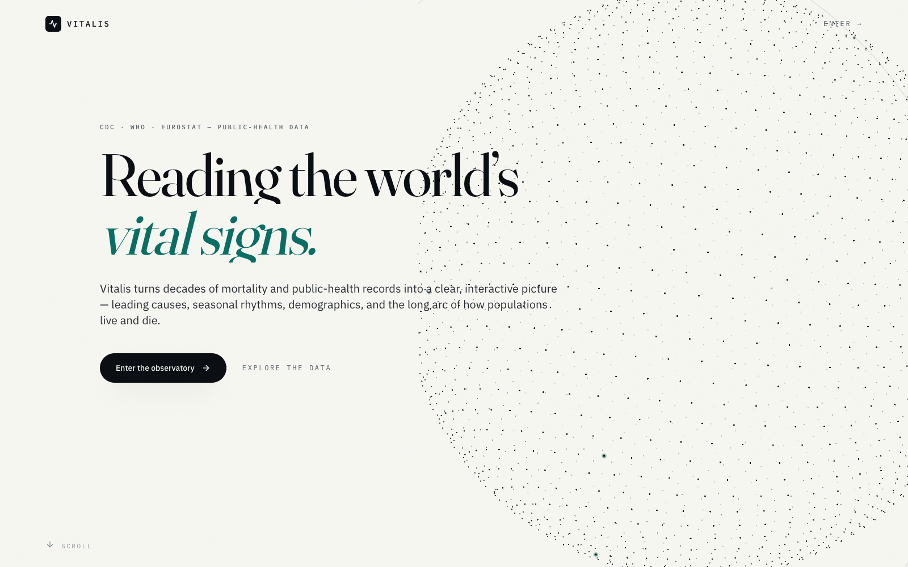
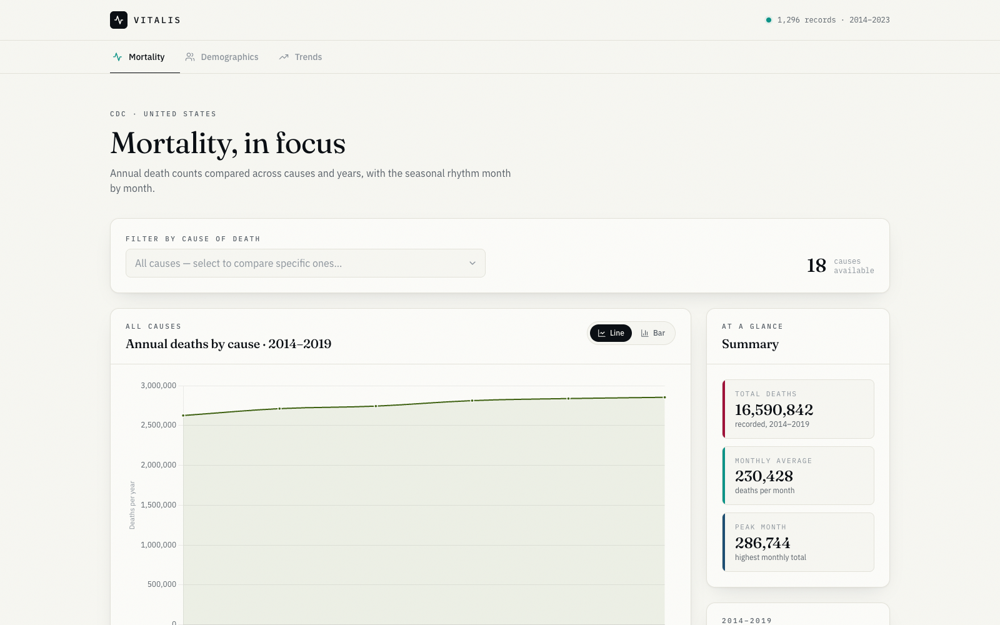
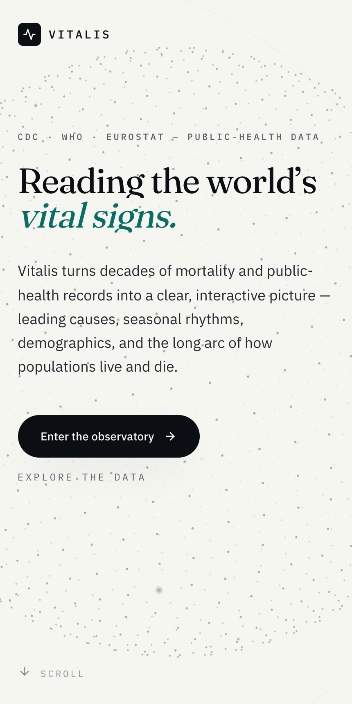

# Vitalis

**A clinical-editorial observatory for mortality and public-health data.**

Vitalis turns decades of public records from the CDC, WHO and Eurostat into a clear,
interactive picture — leading causes, seasonal rhythms, demographics, and the long arc of
how populations live and die. It's built like an award-winning data-journalism piece:
paper-and-ink typography, one confident data palette, a lightweight 3D centerpiece, and
restrained, precise motion.



---

## Highlights

- **Cinematic, scroll-told landing** — an editorial hero with a Three.js point-cloud globe,
  count-up statistics, and a narrative introduction to the data.
- **Three analytical lenses** — annual deaths by cause, demographic breakdowns (age & sex),
  and long-run life-expectancy trends.
- **Honest, credible charts** — re-themed Chart.js with hairline grids, tabular figures, and
  truthful axes (real death counts, not fabricated rates — see [Data notes](#data-notes)).
- **Lightweight 3D** — a monochrome point-cloud globe with pointer parallax that pauses
  offscreen, sheds detail on mobile, and degrades to a static frame under reduced motion.
- **Motion with restraint** — GSAP + ScrollTrigger choreography, fully gated behind
  `prefers-reduced-motion`.
- **Fast & mobile-first** — Chart.js and Three.js are code-split out of the landing critical
  path; verified responsive with zero horizontal overflow from 375 px up.

## Screens

<table>
  <tr>
    <td width="62%"></td>
    <td width="38%"></td>
  </tr>
  <tr>
    <td align="center"><em>Mortality dashboard</em></td>
    <td align="center"><em>Mobile</em></td>
  </tr>
</table>

## Tech stack

- **React 18** + **TypeScript** + **Vite**
- **Tailwind CSS** with a centralized token system (colors, type, motion)
- **GSAP** + **ScrollTrigger** for motion
- **Three.js** for the point-cloud globe
- **Chart.js** (via `react-chartjs-2`) for data visualization
- Type: **Fraunces** (display serif) · **IBM Plex Sans** (UI) · **IBM Plex Mono** (data)

## Getting started

```bash
npm install
npm run dev      # start the dev server
npm run build    # production build
npm run preview  # preview the production build
```

Then open the local URL Vite prints (default `http://localhost:5173`).

## Data notes

Charts are drawn directly from open public records:

| Source | Used for |
| --- | --- |
| **CDC** (`data.cdc.gov`) | U.S. monthly death counts by cause |
| **WHO** | Global health context |
| **Eurostat** | European life tables |

The CDC dataset reports **death counts**, not rates — it has no population field. Vitalis
plots those real counts with honest labels (e.g. "Annual deaths by cause"), and unfiltered
views default to the *All Causes* series so totals stay truthful (~16.6 M deaths across
2014–2019, ~230 K per month).

## Accessibility & performance

- Respects `prefers-reduced-motion`: all GSAP intros and the globe animation are skipped, and
  hidden-until-revealed content is shown immediately.
- Keyboard-focusable controls with a visible focus ring; charts expose data via tooltips.
- Lazy-loaded heavy dependencies keep the initial landing bundle small (~115 KB gzipped).
- Verified in Chrome at 375 / 768 / 1280 px — no console errors, no layout overflow.

## Project structure

```
src/
  design/        # tokens, GSAP motion helpers, Chart.js theme
  components/    # LandingPage, Globe (Three.js), dashboard + chart views
  services/      # CDC / WHO / Eurostat data fetching
  config/        # cause mappings, constants
docs/
  preview/       # screenshots used in this README
  superpowers/   # design spec
```

---

*Built on open public-health data.*
